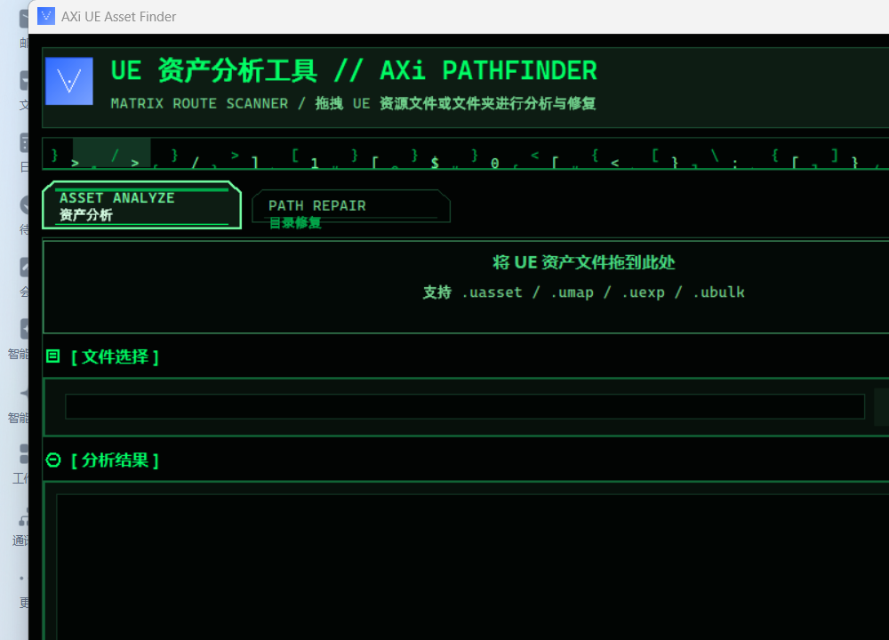

# AXi Unreal Asset Finder

面向 Unreal Engine 资产迁移、整理和排错的小工具。它可以直接分析 `.uasset` / `.umap` / `.uexp` / `.ubulk` 文件，提取 UE 内路径、版本信息、关联文件和导入引用，并提供目录重命名修复辅助。

当前版本：`v1.1.0`

## 功能

- 资产分析：读取 UE 资产头、版本信息、文件大小、特征文本和关联文件。
- UE 路径提取：从二进制内容中提取 `/Game/...` 或 `/Engine/...` 路径。
- 引用查看：解析可见导入/引用字符串，便于定位依赖。
- 拖拽操作：支持拖入资产文件或资产文件夹。
- 目录修复：校验目录内资产路径，支持同长度目录名变更和安全副本模式。
- CLI 模式：可从命令行快速转换单文件或目录路径。
- Windows 打包：通过 PyInstaller 生成免安装发行包。

## 快速开始

### 使用发行版

1. 下载 GitHub Release 中的 `UEAssetPathFinder-v1.1.0-win64.zip`。
2. 解压后运行 `UEAssetPathFinder.exe`。
3. 拖入 UE 资产文件或文件夹。

### 从源码运行

```powershell
python -m venv .venv
.\.venv\Scripts\Activate.ps1
pip install -r requirements.txt
python main.py
```

CLI：

```powershell
python main.py -cli
python main.py "D:\Project\Content\Characters\Hero.uasset"
python main.py "D:\Project\Content\Characters"
```

## 界面



`v1.1.0` 使用深色矩阵风格 UI：

- 绿色终端配色
- 顶部扫描条动画
- 拖拽区域霓虹脉冲
- 终端风结果面板
- 暗色表格和状态条

功能入口、拖拽逻辑、路径解析和目录修复流程保持不变。

## 目录修复安全规则

目录修复只在路径校验通过后启用。

- 默认使用“副本粘贴模式”，先复制目录再修改副本。
- “原位更改模式”会重命名原目录，使用前确认已有备份。
- 新旧目录名长度必须一致，避免破坏 UE 二进制路径偏移。
- 只替换已识别的旧 `/Game/.../` 前缀。

## 项目结构

```text
main.py                 程序入口，选择 GUI / CLI / 快速转换
gui_dnd.py              当前 GUI、拖拽、目录修复界面
ue_parser.py            UE 资产解析和路径提取
asset_finder.py         文件路径到 UE Content 路径的转换逻辑
config.py               默认配置
requirements.txt        Python 依赖
build_exe.spec          PyInstaller 打包配置
assets/                 图标资源
assets/ui-preview-matrix.png  软件界面截图
test_parser.py          解析器基础测试
test_asset.uasset       测试资产样例
DEVELOPMENT.md          开发、测试、打包说明
```

## 构建

```powershell
.\.venv\Scripts\Activate.ps1
pip install -r requirements.txt pyinstaller
pyinstaller --clean --noconfirm build_exe.spec
```

构建完成后输出：

```text
dist\UEAssetPathFinder\UEAssetPathFinder.exe
```

## 已知限制

- 加密、压缩或自定义格式资产可能无法完整解析。
- 超大资产只读取有限范围用于路径扫描，结果可能不完整。
- 目录修复需要新旧目录名长度一致。
- CLI 中部分旧文本仍保留历史编码，GUI 主流程已可读。

## 许可证

当前仓库未声明许可证。发布或二次分发前建议补充明确许可证文件。
